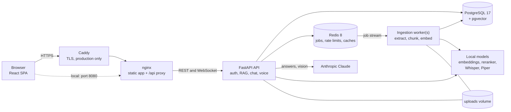
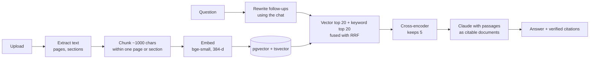
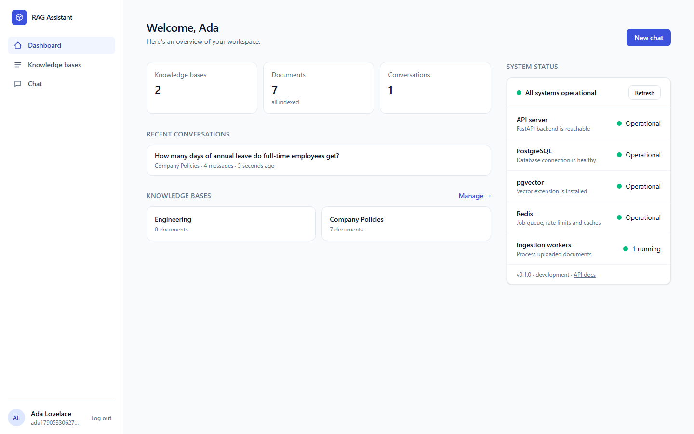
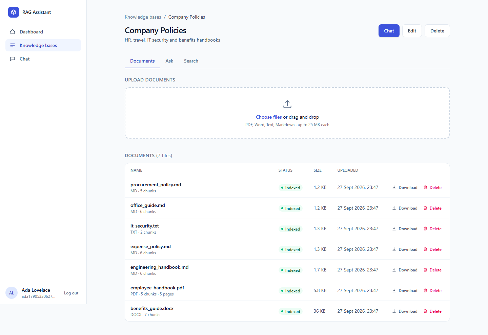
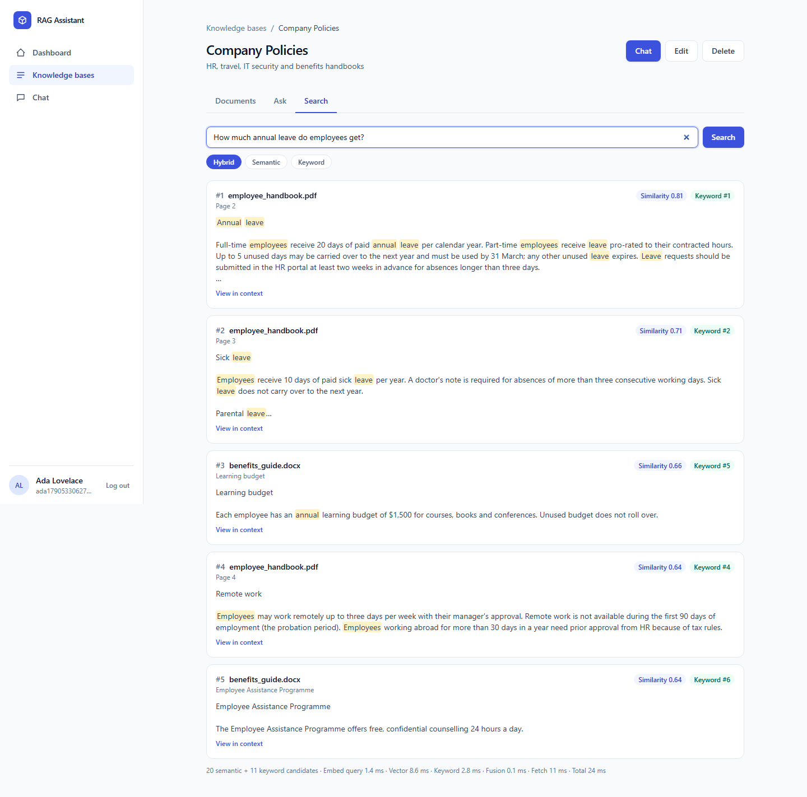
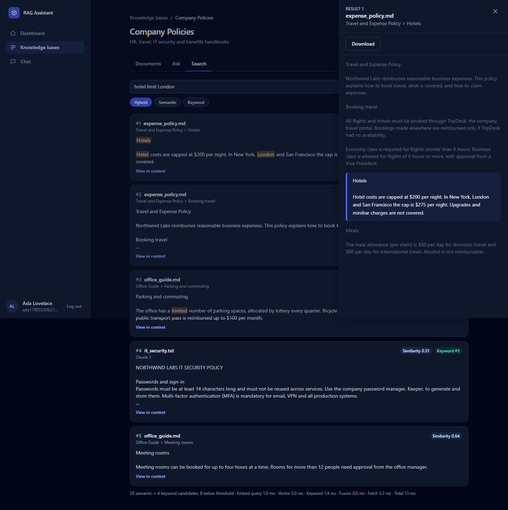
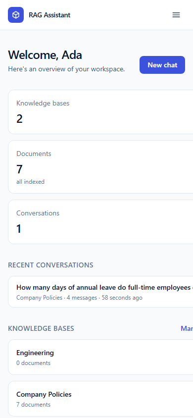

# Mindora AI

**Your knowledge. One intelligent AI.**

Mindora AI is a real-time multimodal RAG assistant. Ask questions about your own documents by typing, speaking or showing a screenshot. Answers are grounded in your files, cite the exact passages they rely on, stream in as they are written, and can be read aloud.

Built as a full-stack, production-minded application: FastAPI and PostgreSQL/pgvector behind a React app, a Redis-backed worker for document processing, local models for embeddings, reranking, speech-to-text and text-to-speech, Claude for answers and image understanding, an evaluation harness, and a Docker setup that deploys with HTTPS.

> **Status.** The original 17 build phases are complete, and the Mindora AI upgrade is in progress (phases 1–5 done). Everything described here is implemented and tested: **512 backend tests** and **159 frontend tests** (backend coverage was 94% when last measured, before the upgrade). The Claude integration is tested against the real SDK with recorded HTTP responses, and has been checked end to end with a real Anthropic API key. The quality of Claude's answers has **not been measured yet**: the answer-quality evaluation is built but has not been run. Retrieval quality has been measured (see [Evaluation](#14-evaluation)).

**Contents:**
1. [Overview](#1-project-overview)
2. [Features](#2-features)
3. [Architecture](#3-architecture)
4. [Tech stack](#4-tech-stack)
5. [Structure](#5-project-structure)
6. [Setup](#6-setup)
7. [Environment](#7-environment-variables)
8. [Database](#8-database-setup)
9. [Running locally](#9-running-locally)
10. [Docker](#10-docker)
11. [API](#11-api-documentation)
12. [RAG pipeline](#12-rag-pipeline)
13. [Multimodal pipeline](#13-multimodal-pipeline)
14. [Evaluation](#14-evaluation)
15. [Screenshots](#15-screenshots)
16. [Deployment](#16-deployment)
17. [Future improvements](#17-future-improvements)

## 1. Project overview

1. Create a **knowledge base** and upload PDF, Word, text or Markdown files.
2. A background worker extracts, chunks and embeds them, showing live progress.
3. Ask questions in the **chat**, by typing or with the microphone, optionally with a screenshot or photo attached.
4. The assistant retrieves the most relevant passages (hybrid vector and keyword search, then a reranker).
5. Claude answers from those passages only, with **citations** that open the exact source passage, or the PDF at the cited page.
6. Answers stream in word by word over a WebSocket, conversations are saved, and any answer can be played back as speech.

What makes it more than a demo:

- **Answers refuse to invent.** Nothing relevant retrieved means "not found", without calling the model. Claude's native citations are verified against the source text.
- **Measured, not assumed.** A labelled evaluation compares retrieval strategies. The similarity threshold, the reranker, chunk sizes and an attempted ranking "improvement" were all decided by measurement; the improvement was reverted because it measured worse.
- **Operationally careful.** If a worker dies mid-document, another worker takes over its job automatically. Rate limits are shared across processes. Through a Redis outage the app keeps working: uploads are queued in the database and rate limits fail open. A PostgreSQL outage produces a clear "temporarily unavailable" error, and the app recovers by itself when the database returns. Both were tested by stopping the services.
- **Secure by default.** Every endpoint's authentication and cross-user isolation is tested automatically from the API schema. The app enforces a strict CSP, sends security headers and redacts secrets from logs.

## 2. Features

| Area | What you get |
|---|---|
| **Accounts** | Registration, login, logout with server-side token revocation. Argon2 password hashing. User and admin roles: admins manage accounts (roles, disabling) but never see anyone's content. A welcome email on sign-up (any SMTP provider). Every resource is private to its owner |
| **Knowledge bases** | Any number per user, each with its own documents and embeddings; a chat answers only from the one selected (tested end to end). Create, rename, delete, search by name or description, sort by activity, name or age, with per-base statistics (documents, passages, storage, chats). Upload PDF, DOCX, TXT and MD (validated by content, 25 MB). Download, re-process, live ingestion progress |
| **Ingestion** | Validation, text and metadata extraction (title, author, date, word, section and table counts) with page and section tracking, cleaning, structure-aware chunking, local embeddings (or Voyage AI), indexed in pgvector. Runs in a separate worker process via Redis, with a live step indicator (extracting → chunking → embedding → indexing), per-stage timings, and failure codes that say whether Retry can help |
| **Retrieval** | Hybrid search: pgvector HNSW plus PostgreSQL full text, fused with reciprocal rank fusion, then cross-encoder reranking. A search tab shows scores and timings |
| **Answers** | Claude, grounded in the retrieved passages, with native citations. Follow-up questions are rewritten using the conversation. A general-chat mode works without documents |
| **Citations** | Inline markers after the supported text. A source viewer highlights the quote in its passage; PDFs open at the cited page |
| **Chat** | Saved conversations with history. Streaming over a WebSocket with live stages ("Searching…", "Writing…") and Stop. Falls back to HTTP if WebSockets are blocked |
| **Images** | Attach, paste or drop screenshots and photos. Answers from the image alone, or from the image combined with the knowledge base |
| **Voice input** | Record in the browser. Local Whisper transcribes into the message box for review before sending |
| **Voice output** | Local Piper text-to-speech for any answer, with Play, Pause, Stop and Replay. Never auto-plays |
| **Reliability** | Redis job queue with crash takeover, retries and a dead-letter stream. Periodic cleanup. Rate limits. Clear errors with a reference ID |
| **Evaluation** | A 36-question labelled dataset. Retrieval metrics per strategy; answer, faithfulness and citation metrics with Claude as judge |
| **Ops** | One-command Docker Compose. A production override with automatic HTTPS (Caddy). CI workflow. Health and readiness endpoints, structured JSON logs |
| **Dashboard** | Real totals, chat answers and tokens over 30 days with a per-day chart, a recent-activity feed, and live system and AI-service status. A Documents page across all knowledge bases, and Settings (profile, password, sign out everywhere, theme) |
| **UI** | Responsive (phone to desktop), light, dark or system theme, toast notifications, skeleton loading states, accessible: 0 axe-core WCAG 2.2 AA violations across all pages in both themes |

## 3. Architecture



- **The API** handles requests: authentication, retrieval, answering (Claude), chat with a streaming WebSocket, and voice (local Whisper and Piper). It never parses documents itself. An upload stores the file, queues a job and returns immediately.
- **Workers** consume the Redis Stream. A job is acknowledged only after its result is committed to PostgreSQL. If a worker dies, its job is taken over, and a document that keeps failing is marked failed with an explanation.
- **PostgreSQL** is the source of truth: users, documents, chunks with their vectors and full-text index, conversations and citations. **Redis** holds only what can be rebuilt: jobs, rate-limit windows, caches and live progress.
- The backend is layered. `api/` handles HTTP concerns only. `services/` holds business rules and ownership checks. `rag/`, `llm/` and `multimodal/` are the pipelines. `workers/` holds the queue, worker and maintenance. `core/` holds config, errors, logging, security and middleware.
- **AI providers are swappable.** The LLM, embeddings, reranker, speech-to-text and text-to-speech are each used through an interface and chosen by an environment variable. LLM requests are built from provider-neutral parts (text, image, citable source) and translated only inside the Claude provider. Every AI call is timed and logged the same way. See [docs/providers.md](docs/providers.md).

## 4. Tech stack

| Layer | Technology |
|---|---|
| Backend | Python 3.11, FastAPI, Pydantic v2, SQLAlchemy 2 (async) + asyncpg, Alembic |
| Data | PostgreSQL 17 with pgvector (HNSW) and full-text search; Redis 8 (Streams, Lua) |
| AI | Anthropic Claude (`claude-opus-5`, streaming, native citations, vision); fastembed `BAAI/bge-small-en-v1.5`; cross-encoder `ms-marco-MiniLM-L-6-v2`; faster-whisper `base`; Piper `en_US-lessac-medium`. All local models run on CPU without API keys. Voyage AI and OpenAI speech are optional alternatives |
| Documents | PyMuPDF, python-docx, PyAV/FFmpeg for audio, Pillow for images |
| Frontend | React 19, TypeScript 6, Vite 8, Tailwind CSS v4, React Router 7 |
| Testing | pytest (+ coverage), Vitest + Testing Library, Playwright for end-to-end checks, axe-core, pip-audit, npm audit |
| Ops | Docker Compose, nginx, Caddy, GitHub Actions |

## 5. Project structure

```
backend/
  app/
    api/            routes (REST + WebSocket) and dependencies (auth, rate limits)
    core/           settings, errors, logging, middleware, security, Redis, caches, rate limiting
    db/  models/    engine and sessions; ORM models (users, knowledge bases, documents, chunks, chats, images)
    schemas/        request/response models
    services/       business logic: auth, knowledge bases, documents, ingestion, retrieval, chat, images
    rag/            extraction, chunking, embeddings, retrieval, reranking, prompts, answer pipeline
    llm/            Claude client (streaming, citations, fallbacks, error mapping)
    multimodal/     image preparation, speech-to-text, text-to-speech
    workers/        Redis job queue, ingestion worker, maintenance
    evaluation/     evaluation dataset, metrics, LLM judge, runner, report
  alembic/          database migrations
  tests/            512 tests (unit, integration against real PostgreSQL/Redis, real-model tests)
  Dockerfile
frontend/
  src/
    pages/          dashboard, knowledge bases, knowledge base detail, chat, auth
    components/     chat, citations (answer rendering), documents, layout, UI primitives
    hooks/  services/  contexts/  utils/
  nginx/  Dockerfile
evaluation/         dataset.json, corpus/, evaluate.py, results/ (see evaluation/README.md)
docs/               detailed documentation (linked below) and screenshots
deploy/Caddyfile    HTTPS entry point
docker-compose.yml  docker-compose.prod.yml  .env.example  .github/workflows/ci.yml
```

## 6. Setup

Prerequisites:
- **Docker** with Compose v2.24 or later (for example, Docker Desktop).
- To develop without containers: **Python 3.11+** and **Node 22+**.
- For answers: an **Anthropic API key** (`LLM_API_KEY`). Without one, everything except generating answers works (upload, search, voice), and the chat explains that the model isn't configured.

```bash
git clone <repository-url> && cd <repository-folder>
cp .env.example .env        # add LLM_API_KEY for answers
```

The fastest way to see it running is [Docker](#10-docker): one command. For development, see [Running locally](#9-running-locally).

## 7. Environment variables

All settings live in `.env` (template: [.env.example](.env.example)). They are validated at startup, and the app refuses to start with an inconsistent or insecure configuration. The ones you're most likely to change:

| Variable | Default | Purpose |
|---|---|---|
| `LLM_PROVIDER` | `anthropic` | LLM implementation (see [docs/providers.md](docs/providers.md)) |
| `LLM_API_KEY` | (none) | Anthropic API key, used for answers and image understanding |
| `MODEL_NAME` | `claude-opus-5` | Claude model |
| `ENVIRONMENT` | `development` | `production` requires a strong `JWT_SECRET` and no wildcard CORS, and enables HSTS |
| `JWT_SECRET` | dev placeholder | Signing key for sessions. Generate with `python -c "import secrets; print(secrets.token_urlsafe(48))"` |
| `DATABASE_URL`, `REDIS_URL` | local ports 5433 / 6380 | Set automatically inside Docker |
| `CORS_ORIGINS` | `http://localhost:5173` | Allowed browser origins (also checked by the WebSocket) |
| `EMBEDDING_PROVIDER` | `local` | `local` (fastembed) or `voyage` (`EMBEDDING_API_KEY`) |
| `RERANKER_PROVIDER` | `local` | `local` cross-encoder or `none` |
| `TOP_K` / `RERANK_CANDIDATES` / `RERANK_TOP_K` | 20 / 20 / 5 | Candidates per retriever, reranked, and passed to Claude |
| `SIMILARITY_THRESHOLD` | `0.5` | Minimum cosine similarity for vector-only hits (measured for bge-small) |
| `CHUNK_SIZE` / `CHUNK_OVERLAP` | 1000 / 150 | Characters per chunk |
| `MAX_FILE_SIZE` | 25 MB | Upload limit |
| `STT_PROVIDER` / `TTS_PROVIDER` | `local` | Whisper and Piper locally, or OpenAI (`STT_API_KEY`, `TTS_API_KEY`) |
| `INGESTION_WORKERS` | 1 | Concurrent documents per worker process |
| `RATE_LIMIT_CHAT` … `RATE_LIMIT_LOGIN` | 20/1m … 10/15m | Rate limits (`<count>/<window>`) |
| `WEB_PORT`, `DOMAIN` | 8080, (none) | Docker web port; production domain for HTTPS |
| `SMTP_HOST`, `SMTP_USERNAME`, `SMTP_PASSWORD`, `EMAIL_FROM` | (none) | Welcome email on sign-up; empty `SMTP_HOST` turns email off. Gmail needs an App Password (see `.env.example`) |

Every other setting (timeouts, caches, audio and image limits, history length, maintenance) is documented in `.env.example` and [config.py](backend/app/core/config.py).

## 8. Database setup

PostgreSQL 17 with the **pgvector** extension runs from the `pgvector/pgvector:pg17` image. Nothing needs installing by hand:

```bash
docker compose up -d postgres redis   # host ports 5433 and 6380 (configurable)
cd backend && alembic upgrade head    # the Docker stack runs this automatically ("migrate" service)
```

The migrations create:
- users and revoked tokens;
- knowledge bases and documents;
- `document_chunks`, with a 384-dimension `vector` column (HNSW index, cosine) and a generated `tsvector` column (GIN index) for full-text search;
- conversations, messages and citation snapshots;
- images.

Every row is owned by a user, and every query filters by that owner. Separate databases are created automatically for tests (`rag_assistant_test`) and evaluation (`rag_assistant_eval`), so neither touches your data. For backups, see [Deployment](#16-deployment).

## 9. Running locally

```bash
docker compose up -d postgres redis

# Backend API (terminal 1)
cd backend
python -m venv .venv && .venv\Scripts\activate      # macOS/Linux: source .venv/bin/activate
pip install -r requirements-dev.txt
alembic upgrade head
uvicorn app.main:app --reload --reload-dir app --port 8000

# Ingestion worker (terminal 2, backend/ with the venv active)
python -m app.workers.ingestion_worker

# Frontend (terminal 3)
cd frontend && npm install && npm run dev              # http://localhost:5173
```

- **First run:** the local models download once (354 MB) into `backend/.model_cache/`.
- **Without a worker**, uploads stay "Queued", and after 20 s the knowledge base page shows the command to start one.
- **Checking the setup:** the dashboard's status card shows PostgreSQL, pgvector, Redis and the number of running workers.
- **Tests:** `pytest` and `npm test`; see [docs/testing.md](docs/testing.md).

## 10. Docker

```bash
cp .env.example .env        # optional: LLM_API_KEY
docker compose up -d --build
```

Open **http://localhost:8080**. The services start in dependency order:
1. PostgreSQL and Redis;
2. `migrate`, which applies migrations and exits;
3. `api` (not published; reached through nginx);
4. `worker`;
5. `web`, nginx serving the built React app and proxying `/api`, including the chat WebSocket.

**First start:**
- The images take about 2 minutes to build. The backend image is 1.2 GB, mostly the local models' ONNX, CTranslate2 and FFmpeg libraries.
- The models (354 MB) download into a volume once.

**Measured memory with every model loaded:** API about 880 MB and worker about 390 MB, so about 1.3 GB for the whole stack.

**Useful commands:**
- `docker compose logs -f api worker` shows the logs.
- `docker compose up -d --scale worker=3` runs more workers.
- `docker compose down` stops everything; add `-v` to also delete the data.

Verified on fresh volumes: the stack was ready in about 15 s, and the migrations succeeded on 5 of 5 fresh starts.

## 11. API documentation

Interactive OpenAPI docs are served at `/docs` (Swagger UI) and `/redoc`; the schema is at `/api/v1/openapi.json`. All endpoints are under `/api/v1`. Every endpoint except `/health*`, `/auth/register` and `/auth/login` requires `Authorization: Bearer <token>`.

| Area | Endpoints |
|---|---|
| Auth | `POST /auth/register`, `POST /auth/login`, `POST /auth/logout`, `GET/PATCH /auth/me`, `POST /auth/change-password`, `POST /auth/logout-all` |
| Dashboard | `GET /dashboard` (totals, chat answers and tokens over 30 days, per-day counts, recent activity) |
| Admin (administrators only) | `GET /admin/users` (search, counts), `PATCH /admin/users/{id}` (role, enable/disable) |
| Knowledge bases | `POST /knowledge-bases`, `GET /knowledge-bases` (search, sort), `GET/PATCH/DELETE /knowledge-bases/{id}`, `GET /knowledge-bases/{id}/documents` |
| Documents | `GET /documents` (all of yours, filter by status or filename), `POST /documents/upload`, `GET/DELETE /documents/{id}`, `POST /documents/{id}/reprocess`, `GET /documents/{id}/chunks`, `GET /documents/{id}/download`, `GET /chunks/{id}` |
| Retrieval and answers | `POST /retrieval/search` (hybrid, vector or keyword), `POST /rag/answer` |
| Chat | `POST /chat`, `GET /conversations`, `GET/PATCH/DELETE /conversations/{id}`, `WS /ws/chat` (streaming; [protocol](docs/multimodal.md#real-time-streaming-websocket)) |
| Images | `POST /images`, `GET /images/{id}/content`, `DELETE /images/{id}`, `POST /multimodal/image` |
| Voice | `POST /voice/transcribe`, `POST /voice/synthesize` |
| System | `GET /system/providers` (which provider and model serves each AI capability; no secrets) |
| Health | `GET /health` (liveness), `GET /health/ready` (database and pgvector; also reports Redis and worker count) |

Errors always use one envelope, `{"error": {"code", "message", "request_id", "details"}}`, with a message meant for users and a request ID that matches the logs. See [docs/security.md](docs/security.md) for the full error catalogue.

## 12. RAG pipeline



1. **Ingestion.** Text is extracted with page numbers (PDF) or heading paths (DOCX and Markdown), cleaned (Unicode normalisation, such as PDF ligatures like "fi" becoming "fi"; invisible characters removed; words hyphenated across lines re-joined; whitespace collapsed). DOCX tables are included, and split into chunks that never cross a page or section, so every citation points to one location. The chunks are embedded and stored.
2. **Retrieval.** Vector search (HNSW, with iterative scans so ownership filtering never starves results) and PostgreSQL full-text search each return candidates, fused with reciprocal rank fusion. Vector-only hits must reach a cosine similarity of 0.5. That threshold was measured: off-topic questions scored ≤ 0.43, relevant ones ≥ 0.61. Exact terms such as error codes survive through the keyword side.
3. **Reranking.** A local cross-encoder rescores the 20 candidates and keeps the 5 best. If the reranker fails, the retrieval order is used.
4. **Answering.** The 5 passages are sent to Claude as `document` blocks with citations enabled. A strict grounding prompt applies, and follow-up questions are first rewritten into standalone search queries. If nothing relevant was retrieved, the answer is "not found" and **Claude isn't called**. If Claude answers without citing anything, the answer is labelled as not found in the documents.
5. **Citations.** Claude's citation spans map to the passages. Each quote is located in the stored text (never guessed) for highlighting, and a snapshot of every source is saved with the message, so old answers still show their sources after documents change.

Full details: [docs/rag-pipeline.md](docs/rag-pipeline.md).

## 13. Multimodal pipeline

- **Images.** Uploads are validated by decoding them, checked against size and pixel limits (decompression bombs are rejected), and downscaled to 1568 px before being sent to Claude. With a knowledge base selected, Claude first describes the image's visible text as a search query, so a screenshot of an error message retrieves the matching troubleshooting page. The answer is then labelled as *from the image*, *from the image and the documents*, or *from the documents*.
- **Voice input.** The browser records Opus/WebM (or MP4 on Safari). The server decodes it with FFmpeg, whatever the file claims to be, and transcribes it with faster-whisper `base`: about 1 s for a 6.6 s question on CPU. Voice-activity detection prevents hallucinated text from silence. The transcript goes into the message box to review; nothing is sent automatically.
- **Voice output.** Piper speaks the answer with markdown and citation markers stripped, at about 25× real time on CPU. The result is an MP3 cached in Redis. The browser player has Play, Pause, Stop and Replay, and only one answer plays at a time. It never auto-plays.
- **Streaming.** One WebSocket per browser session:
  - The token is sent in the first message, never in the URL, and the connection's `Origin` is checked.
  - Stages and answer text stream as Claude writes, and Stop cancels the Claude request.
  - The saved answer, with its citations, then replaces the preview.
  - If WebSockets are unavailable, chat falls back to HTTP.

Full details: [docs/multimodal.md](docs/multimodal.md).

## 14. Evaluation

`python evaluation/evaluate.py` runs the application's own pipeline against a labelled dataset in an isolated database:
- **Dataset:** 36 questions (factual, paraphrase, exact-term, multi-hop and 6 unanswerable) over a 7-document corpus with deliberate distractors.
- **Labels:** evidence snippets, so they stay valid when chunking changes.
- **Answers:** `--answers` adds fact recall, faithfulness and answer relevance (Claude as judge, returning structured verdicts), citation checks and correct abstention.

**Measured retrieval** (30 answerable questions, local models, CPU):

| Strategy | Hit@1 | Hit@3 | MRR | p50 latency |
|---|---|---|---|---|
| Vector only | 86.7% | 96.7% | 0.917 | 16 ms |
| Keyword only | 86.7% | 93.3% | 0.900 | 6 ms |
| Hybrid (RRF) | 93.3% | 100% | 0.961 | 16 ms |
| **Hybrid + rerank** (used) | 93.3% | 100% | 0.967 | 580 ms |

Findings:
- Vector and keyword search fail on *different* questions, and hybrid fixes both.
- The reranker adds little on a corpus this small.
- No similarity or reranker threshold can tell answerable from unanswerable questions, which is why abstention is left to Claude's grounding.
- An IDF-weighted keyword ranking that looked like an obvious fix measured worse and was reverted.

The corpus is small and written for the evaluation, so these numbers compare strategies; they don't estimate accuracy on your documents. **Answer-level metrics have not been run**, because no API key was available.

Full details: [evaluation/README.md](evaluation/README.md).

## 15. Screenshots

| Dashboard | Documents with ingestion status |
|---|---|
|  |  |

| Hybrid search with scores | Source viewer (dark theme) |
|---|---|
|  |  |



*Screenshots of answers are still to come. Every answer screen shows Claude's output, and this project has only been run against a local mock of the API. Its answers would misrepresent the product, so they aren't shown.*

## 16. Deployment

A single server with Docker is the tested target (for example 2 vCPU and 4 GB RAM, a domain, and ports 80/443 open):

```bash
# .env: DOMAIN=rag.example.com, JWT_SECRET=<48+ random chars>, POSTGRES_PASSWORD=<random>, LLM_API_KEY=<key>
docker compose -f docker-compose.yml -f docker-compose.prod.yml up -d --build
```

The production override:
- **HTTPS:** adds **Caddy**, with automatic Let's Encrypt certificates, HTTP-to-HTTPS redirects, HSTS and HTTP/3.
- **Exposure:** publishes only ports 80 and 443.
- **Production mode:** strong secrets are required, and Compose stops with a clear message if one is missing.
- **Client addresses:** forwarded headers are trusted only from Caddy's network, so rate limits apply to real clients.

**Operating it:**
- **Updates:** re-run the same command; migrations run first, and workers finish their current document.
- **Backups:** `pg_dump` plus the `uploads` volume.
- **Scaling:** add workers with `--scale worker=N`; managed PostgreSQL (with pgvector) and Redis drop in via `DATABASE_URL` and `REDIS_URL`.
- **CI** ([ci.yml](.github/workflows/ci.yml)): lint, tests against real PostgreSQL and Redis, dependency audits, an image build and a smoke test.

The production stack was verified locally with Caddy's local certificate authority: HTTPS, secure WebSocket, the full browser flow, and no CSP violations. Two issues found there are fixed: a spoofable client-address header and a database startup race. Deploying to a public domain, and running the CI workflow on GitHub, haven't happened yet.

Full details: [docs/operations.md](docs/operations.md).

## 17. Future improvements

- **Measure answer quality with Claude:** run `evaluate.py --answers` with a key, then grow the dataset with questions over real document collections and user feedback (thumbs up/down on answers).
- **OCR** for scanned PDFs, which currently fail with a clear "no readable text" message.
- **Better keyword ranking:** true BM25, with term frequency and length normalisation (for example ParadeDB's `pg_search`). The IDF-only experiment showed that rarity alone isn't enough.
- **Prompt caching** of the system prompt and repeated passages, to cut Claude cost and latency on follow-up questions.
- **Lower-latency speech:** synthesise sentence by sentence while the answer streams, instead of after it finishes.
- **Sessions:** refresh tokens in HttpOnly cookies instead of short-lived tokens in `localStorage`.
- **Sharing:** team workspaces and shared knowledge bases with roles; currently everything is private to one user.
- **Observability:** OpenTelemetry traces and Prometheus metrics alongside the structured logs.
- **Storage and scale:** object storage (S3-compatible) for uploads instead of a local volume, and a Helm chart for Kubernetes.
- **Multilingual retrieval:** a multilingual embedding model (the vector size is configurable, with a migration).

## Documentation

| Document | Contents |
|---|---|
| [docs/rag-pipeline.md](docs/rag-pipeline.md) | Knowledge bases, ingestion, retrieval, answers, citations, chat history, with measurements |
| [docs/providers.md](docs/providers.md) | The AI provider interfaces, provider-neutral messages, adding a provider, per-call `ai_call` logging |
| [docs/multimodal.md](docs/multimodal.md) | Images, voice input, voice output, WebSocket streaming protocol |
| [docs/operations.md](docs/operations.md) | Redis and background jobs, the worker's reliability design, deployment |
| [docs/security.md](docs/security.md) | Authentication, security measures and tests, error catalogue, debugging a failed request |
| [docs/testing.md](docs/testing.md) | Test suites, coverage, how to run them |
| [evaluation/README.md](evaluation/README.md) | Evaluation dataset, metrics, results and experiments |
